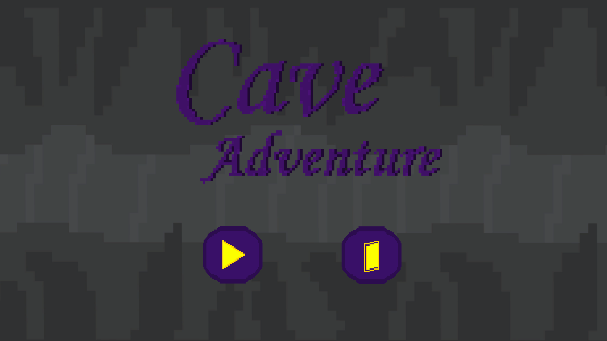
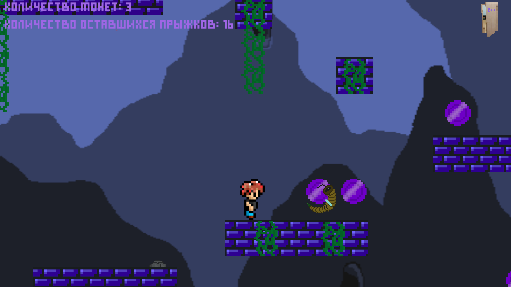
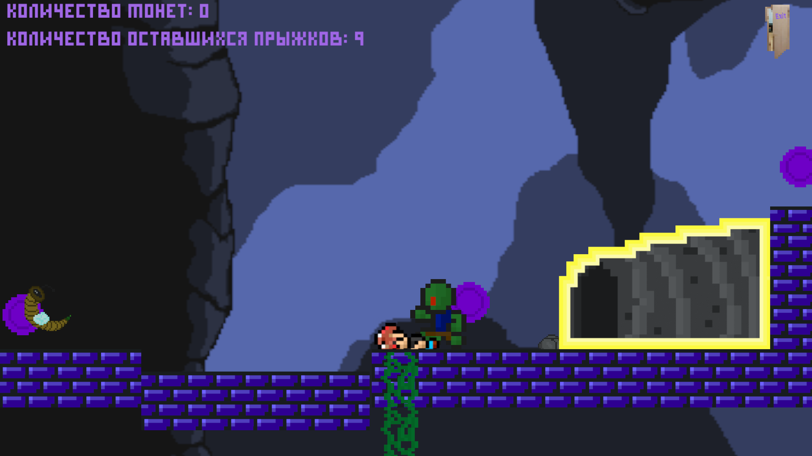

<h1 align="center">Cave Adventures</h1>
<h4 align="center">Cave Adventures is a simplest 2D-platformer. The main task of the hero is to clear all the locations from monsters and find a way out.</h4>

## Features:
- Animated textures,
- Unique gameplay,
- Support for adding third-party levels.
  
## Controls:
- **A/D** or **←/→** - character movement left-right
- **Space** - jump

## Running from sources:
- Install your preferred version of **Unity** from the **Hub**
- Create a new project, save and then replace the **“Assets”** folder with the one that is **in this repository**
- Build, run and enjoy
